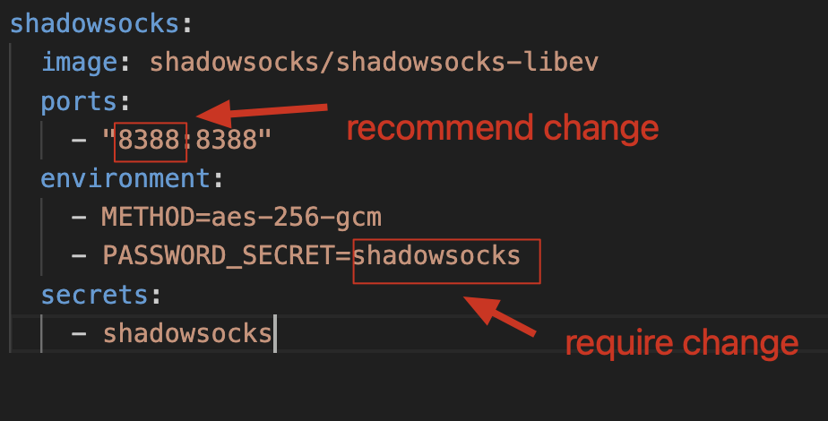

# official document

https://github.com/shadowsocks/shadowsocks-libev/blob/master/docker/alpine/README.md


# Simple Step

1. Create  ```docker-compose.yml```, recommend create a single directory to save config file . 
 <br>
 for example  ``` ~/shadowsocket/config```
2. Add config parameter
```
shadowsocks:
  image: shadowsocks/shadowsocks-libev
  ports:
    - "8388:8388"
  environment:
    - METHOD=aes-256-gcm
    - PASSWORD_SECRET=shadowsocks
  secrets:
    - shadowsocks
```




3. 
```
cd ~/shadowsocket/config
curl -sSLO https://github.com/shadowsocks/shadowsocks-libev/raw/master/docker/alpine/docker-compose.yml
docker-compose up -d
docker-compose ps
```

4. should config first port  rule for VPS or host <br>
the case of AWS:
